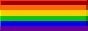
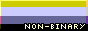
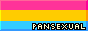
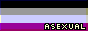

## Library

Here's a list of badges that are currently available.

Right-click on the badge you want to use and select "Copy Image Address" to get the URL.

I'm not entirely satisfied with some of the badges, so I might update them in the future.
If you have any suggestions for new badges, feel free to open an issue or a pull request.
Also, I'm still learning and am not a professional artists - so please be patient with me.
If you know how to improve the badges, or skills I need to learn, please let me know!

### Software

| Badge | Description |
| --- | --- |
|  | Made with Aseprite. |
|  | Made with Godot Engine. |

### Pride

<!-- Trans women are women :3-->
<!-- Trans men are men :3 -->
<!-- Non-binary people are valid :3 -->
<!-- Get over it >:3 -->

| Badge | Description |
| --- | --- |
|  |The LGBTQ+ community. |
|  | The LGBTQ+ community, with the addition of the black and brown stripes to represent people of color, with further colors reinforcing the representation of communities. | 
|  | Those who do not identify with their assigned gender at birth. | 
|  | Those who were initially assigned not as female at birth, but identify as such. |
|  | Those who were initially assigned not as male at birth, but identify as such. | 
|  | Those who do not identify with the binary genders. |
|  | Those who do not identify with any gender, or identify as genderless. | 
|  | Those who are [plural systems.](https://pluralpedia.org/w/Plurality) | 
|  | Women who are attracted to other women. |
|  | Those who are attracted to people regardless of gender identity. |
|  | Those who are attracted to both binary genders, or more than one gender, etc. |
|  | Those who experience seldom to no sexual attraction. |
|  | A broad umbrella of any orientation of a woman or woman-aligned person attracted to other women or women-aligned people. |

### Pronouns

| Badge | Description |
| --- | --- |
|  | The pronouns "He/Him". |
|  | The pronouns "She/Her". |
|  | The pronouns "They/Them". |
|  | The pronouns "It/Its". |

### Politics

| Badge | Description |
| --- | --- |
|  | Support for Ukraine in the face of Russian aggression. |