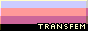
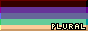

## Library

Here's a list of badges that are currently available.

Right-click on the badge you want to use and select "Copy Image Address" to get the URL.

### Pride

<!-- Trans women are women :3-->
<!-- Trans men are men :3 -->
<!-- Non-binary people are valid :3 -->
<!-- Get over it >:3 -->

| Badge | Name | Description |
| --- | --- | --- |
|  | Pride | The LGBTQ+ community. |
|  | Progress Pride | The LGBTQ+ community, with the addition of the black and brown stripes to represent people of color, with further colors reinforcing the representation of communities. | 
|  | Transgender | Those who do not identify with their assigned gender at birth. | 
|  | Transfeminine | Those who were initially assigned not as female at birth, but identify as such. |
|  | Transmasculine | Those who were initially assigned not as male at birth, but identify as such. | 
|  | Nonbinary | Those who do not identify with the binary genders. |
|  | Agender | Those who do not identify with any gender, or identify as genderless. | 
|  | Plural | Those who are [plural systems.](https://pluralpedia.org/w/Plurality) | 
|  | Pansexual | Those who are attracted to people regardless of gender identity. |

### Pronouns

| Badge | Name | Description |
| --- | --- | --- |
|  | He/Him | The pronouns "He/Him". |
|  | She/Her | The pronouns "She/Her". |
|  | They/Them | The pronouns "They/Them". |
|  | It/Its | The pronouns "It/Its". |
