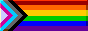
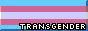
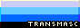

# 88x31 Badges

A collection of 88x31 badges for use in... Whatever you want to use them for!

- Software tagging!
- Website linking!
- Profile decoration!
- Whatever you want!

88x31 badges are a classic form of web decoration, harkening back to the days of '95. They're a great way to add a little flair to your project, and they're a fun way to show off your affiliations, interests, skills... And so on!

In order to appear as authentic as possible, these badges are designed with the following limitations:

- 256-color palette, used by Windows 95
- Indexed color mode
- 88x31 resolution

These badges may contain customization options within the provided Aseprite files. Feel free to modify them to your heart's content!

## Usage

To use these badges, simply find the one you want to use, copy its URL, and use it in any of these manners:

- Markdown

> `markdown
> [](
>

- HTML

> `html
>   <!-- You can optionally enclose it in an <a> tag to add a hyperlink -->
>   " alt="Badge">
> `

## Contributing

If you'd like to contribute to this project, feel free to fork it and submit a pull request! You can also submit an issue if you have any suggestions or requests.

But please keep in mind the limitations of the project. These badges are designed to be simple and retro, so please keep that in mind when creating new badges.

## Library

Here's a list of badges that are currently available:

### Pride

<!-- Trans women are women :3-->
<!-- Trans men are men :3 -->
<!-- Non-binary people are valid :3 -->
<!-- Get over it >:3 -->

| Badge | Name | Description | URL |
| --- | --- | --- | --- |
|  | Pride | A badge representing the LGBTQ+ community. | `https://raw.githubusercontent.com/TheFelidae/88x31/refs/heads/main/images/pride/badge_pride.png?raw=true` |
|  | Progress Pride | A badge representing the LGBTQ+ community, with the addition of the black and brown stripes to represent people of color, with further colors reinforcing the representation of communities. | `https://raw.githubusercontent.com/TheFelidae/88x31/refs/heads/main/images/pride/badge_progress.png?raw=true` |
|  | Transgender | A badge representing those who do not identify with their assigned gender at birth. | `https://raw.githubusercontent.com/TheFelidae/88x31/refs/heads/main/images/pride/badge_transgender.gif?raw=true` |
|  | Transfeminine | A badge representing those who were initially assigned not as female at birth, but identify as such. | `https://raw.githubusercontent.com/TheFelidae/88x31/refs/heads/main/images/pride/badge_transfem.gif?raw=true` |
|  | Transmasculine | A badge representing those who were initially assigned not as male at birth, but identify as such. | `https://raw.githubusercontent.com/TheFelidae/88x31/refs/heads/main/images/pride/badge_transmasc.gif?raw=true` |
|  | Nonbinary | A badge representing those who do not identify with the binary genders. | `https://raw.githubusercontent.com/TheFelidae/88x31/refs/heads/main/images/pride/badge_nonbinary.gif?raw=true` |
|  | Agender | A badge representing those who do not identify with any gender, or identify as genderless. | `https://raw.githubusercontent.com/TheFelidae/88x31/refs/heads/main/images/pride/badge_agender.gif?raw=true` |
|  | Plural | A badge representing those who are [plural systems.](https://pluralpedia.org/w/Plurality) | `https://raw.githubusercontent.com/TheFelidae/88x31/refs/heads/main/images/pride/badge_plural.gif?raw=true` |

### Pronouns

| Badge | Name | Description | URL |
| --- | --- | --- | --- |
|  | He/Him | A badge representing the pronouns "He/Him". | `https://raw.githubusercontent.com/TheFelidae/88x31/refs/heads/main/images/pronouns/badge_he_him.png?raw=true` |
|  | She/Her | A badge representing the pronouns "She/Her". | `https://raw.githubusercontent.com/TheFelidae/88x31/refs/heads/main/images/pronouns/badge_she_her.png?raw=true` |
|  | They/Them | A badge representing the pronouns "They/Them". | `https://raw.githubusercontent.com/TheFelidae/88x31/refs/heads/main/images/pronouns/badge_they_them.png?raw=true` |
|  | It/Its | A badge representing the pronouns "It/Its". | `https://raw.githubusercontent.com/TheFelidae/88x31/refs/heads/main/images/pronouns/badge_it_its.png?raw=true` |

## License

This project is dedicated to the public domain under the [Unlicense](https://unlicense.org/). You are free to copy, modify, publish, use, compile, sell, or distribute this software, either in source code form or as a compiled binary, for any purpose, commercial or non-commercial, and by any means.
